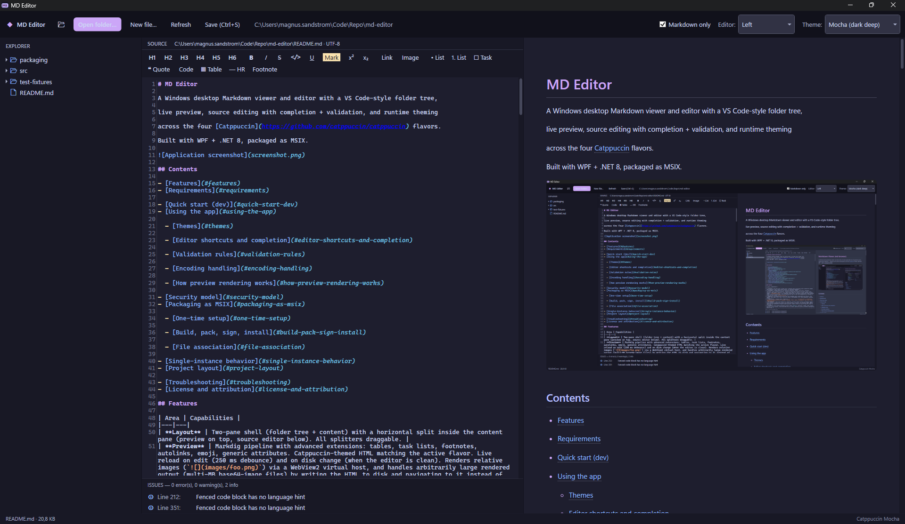

# MD Editor

A Windows desktop Markdown viewer and editor with a VS Code-style folder tree,

live preview, source editing with completion + validation, and runtime theming

across the four [Catppuccin](https://github.com/catppuccin/catppuccin) flavors.

Built with WPF + .NET 8, packaged as MSIX.



## Contents

- [Features](#features)
- [Requirements](#requirements)

- [Quick start (dev)](#quick-start-dev)
- [Using the app](#using-the-app)

  - [Themes](#themes)

  - [Editor shortcuts and completion](#editor-shortcuts-and-completion)

  - [Validation rules](#validation-rules)

  - [Encoding handling](#encoding-handling)

  - [How preview rendering works](#how-preview-rendering-works)

- [Security model](#security-model)
- [Packaging as MSIX](#packaging-as-msix)

  - [One-time setup](#one-time-setup)

  - [Build, pack, sign, install](#build-pack-sign-install)

  - [File association](#file-association)

- [Single-instance behavior](#single-instance-behavior)
- [Project layout](#project-layout)

- [Troubleshooting](#troubleshooting)
- [License and attribution](#license-and-attribution)

## Features

| Area | Capabilities |
|---|---|
| **Layout** | Two-pane shell (folder tree + content) with a horizontal split inside the content pane (preview on top, source editor below). All splitters draggable. |
| **Preview** | Markdig pipeline with advanced extensions: tables, task lists, footnotes, autolinks, emoji, generic attributes. Catppuccin-themed HTML matching the active flavor. Live reload on edit (250 ms debounce) and on disk change (when the editor is clean). Renders relative images (``) via a WebView2 virtual host, and handles arbitrarily large rendered output (multi-MB base64-image files) by writing the HTML to disk and navigating to it instead of using the size-limited `NavigateToString`. |
| **Editor** | AvalonEdit-based source pane with Markdown syntax highlighting per flavor, line numbers, word wrap, Ctrl+S save, Ctrl+N to create a new Markdown file, dirty indicator, encoding display. |
| **Completion** | Snippet popup triggered by `[`, `!`, `` ``` `` at line start, or Ctrl+Space. Includes 32 fenced-code-block languages, headings, lists, tables, blockquotes, task lists, link/image templates. |
| **Validation** | Real-time Markdig AST inspection. Surfaces broken relative link/image targets, empty headings, heading-level skips, code fences without a language, and **broken `data:` URIs** (truncated or placeholder-stripped base64 payloads). Double-click any issue to jump the caret to that line. |
| **Themes** | Four runtime-switchable flavors: Mocha (default), Macchiato, Frappé, Latte. Choice persists across launches. Dark/light DWM title bar adapts. WebView2 preview and editor highlighting both follow. |
| **Security** | WebView2 has JavaScript disabled, host objects disabled, web messaging disabled. Rendered HTML carries a strict Content-Security-Policy (`script-src 'none'; object-src 'none'; frame-src 'none'`). External links open in the system browser; internal anchors scroll the preview. |
| **File handling** | UTF-8 / UTF-16 / UTF-32 BOM detection, strict UTF-8 fallback to Windows-1252 (for legacy Swedish/Western-European docs). Saves always normalize to UTF-8 without BOM. |
| **Process model** | Single-instance enforced via named mutex. A second launch forwards its file path through a named pipe and exits; the existing window focuses and opens the file. |
| **Packaging** | Full MSIX pipeline: cert generation, asset generation, publish, pack, sign. File association registered for `.md`, `.markdown`, `.mdown`, `.mkd`, `.mkdn`. |

## Requirements

- **Windows 10 1809 (build 17763) or newer** (Windows 11 recommended).
- **.NET 8 SDK** for building (`winget install Microsoft.DotNet.SDK.8`).

- **WebView2 Evergreen Runtime** for running. Preinstalled on Windows 11. On Windows 10 install from

  [Microsoft's WebView2 page](https://developer.microsoft.com/microsoft-edge/webview2/).

- **Windows 10/11 SDK** for packaging only — provides `makeappx.exe` and `signtool.exe`. Install via the

  Visual Studio Installer ("Windows 10 SDK" or "Windows 11 SDK" component) or

  `winget install Microsoft.WindowsSDK.10.0.26100`.

## Quick start (dev)

From the repo root:
```powershell

# Restore + build

dotnet build .\md-editor.sln

# Run

dotnet run --project .\src\md-editor\md-editor.csproj
```
That gives you a working app for development. No certificate or packaging

needed. Use **File > Open folder…** in the UI (or point a CLI arg at a `.md`

file) to start browsing.

## Using the app

### Themes

Top-right of the toolbar: a dropdown with Mocha, Macchiato, Frappé, Latte.

Switching is instant — all colors update through DynamicResource brushes,

syntax highlighting rebuilds in the new palette, and the preview re-renders.

The chosen flavor persists to `%LOCALAPPDATA%\md-editor\theme.txt`. Delete that

file to reset to default (Mocha).

### Editor shortcuts and completion

| Trigger | Action |
|---|---|
| **Ctrl+S** | Save the editor to disk (UTF-8 without BOM). Toolbar button does the same. |
| **Ctrl+N** | Create a new Markdown file: pick a name/location, an empty file is written to disk, added to the tree (or opens a new root folder if the target is outside the currently open folder), and loaded into the editor. Toolbar "New file…" button does the same. Prompts if the current file has unsaved changes. |
| **Ctrl+Space** | Open the full snippet popup (32 fenced-code-block languages plus headings, lists, tables, links, images, blockquotes, hr, task items). |
| **`[`** | Suggest link and image templates. |
| **`!`** | Suggest image templates. |
| **Third `` ` `` on a line starting with `` ``` ``** | Suggest a code-fence language. |
| **Type into the editor** | Preview re-renders after 250 ms of idle. The "● modified" indicator appears in the editor header until you save. |
| **Click a file in the tree while editor is dirty** | Confirmation prompt before discarding. |
| **External file change** | If the editor has no unsaved edits, content reloads. If dirty, your edits are preserved and the status bar warns. |

### Validation rules

Every edit kicks off a debounced Markdig parse. Findings appear in the

**ISSUES** panel below the editor:

| Severity (glyph) | What it catches |
|---|---|
| Error (red ●) | Broken relative `[text](path)` or `` — target file does not exist next to the source. |
| Error (red ●) | Broken `data:` URI — no comma separator, payload shorter than 32 chars, contains `...` placeholder, or literal `stripped`/`removed`/`redacted`. |
| Warning (yellow ▲) | Empty heading. |
| Warning (yellow ▲) | Heading level skip (e.g., H1 → H3 with no H2 between). |
| Info (blue ⓘ) | Fenced code block without a language hint. |

**Double-click any issue** to jump the editor caret to that line and column.

### Encoding handling

When opening a file the app tries, in order:

1. UTF-32 LE BOM, UTF-8 BOM, UTF-16 LE BOM, UTF-16 BE BOM.
2. Strict UTF-8 (throws on invalid bytes).

3. Windows-1252 fallback (registered via `System.Text.CodePagesEncodingProvider`).

The detected encoding is shown next to the file path in the editor header

(e.g. `… · Windows-1252`). When you save, output is always **UTF-8 without

BOM** — a deliberate one-time upgrade for legacy files. The status bar

confirms this on save.

### How preview rendering works

The preview pane is a WebView2 control with two cooperating virtual hosts —

both registered at startup via `CoreWebView2.SetVirtualHostNameToFolderMapping`:

| Virtual host | Mapped to | Purpose |
|---|---|---|
| `md-editor-preview.local` | `%LOCALAPPDATA%\md-editor\Preview\` | Where the rendered HTML document lives. On every render, the markdown is converted to HTML, written to `preview.html`, and the WebView2 navigates to `https://md-editor-preview.local/preview.html?v=<counter>`. Cache-busting query forces a real reload on theme switch or live edit. |
| `md-editor.local` | the open file's parent directory | Where the *resources* referenced by the markdown live — local images, CSS, fonts. The rendered document's `<base href="https://md-editor.local/">` resolves all relative URLs against this folder. Replaced on every file open so it always tracks the currently-open file. |

This indirection is the reason the viewer handles both:

- **Relative images** (``). Without the source-dir virtual

  host, WebView2 refuses `file://` reads from an `about:blank` document

  (cross-origin restriction), so the image silently does not appear.

- **Huge documents** (multi-MB base64-embedded images). `NavigateToString` is

  documented to cap around 2 MB and silently hangs past that. Navigating to a

  file URL has no such limit.

Internal markdown links (e.g. `[See spec](spec.md)`) become

`https://md-editor.local/spec.md` after base-href resolution. The navigation

handler intercepts that origin and:

- If the target is another markdown file → loads it into the editor (and

  follows folder changes automatically).

- If the target is a non-markdown local file (PDF, image, …) → hands it to

  the OS via `Process.Start`.

- If the target is missing → shows a status-bar warning.

## Security model

Markdown files can carry raw HTML, so the rendered document is treated as

untrusted. Defenses, top to bottom:

1. **JavaScript is disabled in WebView2** (`IsScriptEnabled = false`). Even

   raw `<script>` blocks in markdown won't execute.

2. **Web messaging and host objects are disabled** (`IsWebMessageEnabled = false`,

   `AreHostObjectsAllowed = false`).

3. **Strict Content-Security-Policy** on every rendered HTML page:
```
   default-src 'none'; img-src data: blob: file: https: http:;

   style-src 'unsafe-inline'; script-src 'none'; object-src 'none';

   frame-src 'none'; connect-src 'none';
```
4. **External links open in the system browser**, not in the preview pane.

   `CoreWebView2.NavigationStarting` classifies every navigation:

   - `about:` / `data:` / `file:` — allowed (our own welcome screen + WebView2 internals).

   - `https://md-editor-preview.local/…` — allowed (our own rendered preview).

   - `https://md-editor.local/…` — intercepted as an *internal* markdown

     link, opened in the editor (or handed to the OS for non-md files).

   - Any other `http://`, `https://`, or `mailto:` — cancelled and handed to

     `Process.Start(uri) { UseShellExecute = true }`.

   - Anything else (custom protocols, exotic schemes) — blocked.

   `NewWindowRequested` is treated the same way.

5. **No referrer leaks** — `<meta name="referrer" content="no-referrer">` on

   every rendered page.

## Packaging as MSIX

The packaging flow is three scripts in `packaging/`. Run them once in this

order to produce a signed `.msix` you can install.

### One-time setup

```powershell

# (1) Generate placeholder MSIX tile PNGs and the multi-size .ico for the .exe.

#     These get committed to the repo so contributors don't all need to run this.

.\packaging\New-Assets.ps1

# (2) Generate a self-signed code-signing certificate.

#     Prompts for a PFX password; writes certs/md-editor.pfx and md-editor.cer.

.\packaging\New-MdEditorCert.ps1

# (3) Trust the public cert on this machine so MSIX install accepts it.

#     Needs an elevated PowerShell.

Import-Certificate -FilePath .\packaging\certs\md-editor.cer `

    -CertStoreLocation Cert:\LocalMachine\TrustedPeople
```
The cert's subject (`CN=MD Editor Dev, O=MD Editor, C=SE` by default) **must

exactly match** the `<Identity Publisher="…">` line in

`packaging/Package.appxmanifest`. If you regenerate with a custom subject, also

update the manifest, or `Add-AppxPackage` will fail with 0x800B0109.

### Build, pack, sign, install

```powershell
$pw = Read-Host 'PFX password' -AsSecureString

# Publish (dotnet) -> pack (makeappx) -> sign (signtool). Output: packaging/out/md-editor.msix

.\packaging\Build-Msix.ps1 `

    -PfxPath .\packaging\certs\md-editor.pfx `

    -PfxPassword $pw

# Install it

Add-AppxPackage .\packaging\out\md-editor.msix
```
The build script auto-discovers `makeappx.exe` and `signtool.exe` from the

Windows SDK under `C:\Program Files (x86)\Windows Kits\10\bin\<version>\x64\`

— you do not need them on `PATH`.

### File association

After install, `.md`, `.markdown`, `.mdown`, `.mkd`, `.mkdn` are registered.

Double-click a Markdown file in Explorer and:

- If no Markdown Viewer is running, it launches and opens the file (its parent

  folder is loaded into the tree).

- If one is already running, the file path is forwarded over a named pipe and

  the existing window focuses and opens the file. The second process exits

  immediately — see [Single-instance behavior](#single-instance-behavior).

To uninstall:
```powershell
Get-AppxPackage md-editor.MarkdownEditor | Remove-AppxPackage
```

## Single-instance behavior

Implemented in `App.xaml.cs` with a global named mutex plus a named pipe:

- Mutex name: `Global\MdEditor.Singleton.B1A47A1F-7C6E-4F2A-9D7B-7A2C8E1E3F11`
- Pipe name: `MdEditor.Pipe.B1A47A1F-7C6E-4F2A-9D7B-7A2C8E1E3F11`

The first instance owns the mutex and runs a `NamedPipeServerStream` loop on a

background task. Subsequent launches:

1. Fail to acquire the mutex.
2. Open a `NamedPipeClientStream` and write the file path they were started with.

3. Call `Shutdown(0)`.

The first instance receives the path, marshals to the UI thread via

`Dispatcher.BeginInvoke`, activates the window, and opens the file. A focus

flicker workaround (`Topmost = true; Topmost = false`) forces foreground even

when Windows would otherwise reject the activation.

## Project layout

```
md-editor.sln

src/md-editor/

  App.xaml                       Catppuccin theme + Controls.xaml merged at startup

  App.xaml.cs                    Single-instance, CLI args, code-pages registration

  MainWindow.xaml                Two-pane layout, preview + editor split, issues list

  MainWindow.xaml.cs             WebView2 init, link interception, editor wiring

  Assets/

    md-editor.ico                Window icon (16/32/48/64/128/256)

  Themes/

    Controls.xaml                Flavor-independent control styles (ComboBox, TreeView, etc.)

    CatppuccinMocha.xaml         Brushes for dark deepest (default)

    CatppuccinMacchiato.xaml     Brushes for dark medium

    CatppuccinFrappe.xaml        Brushes for dark warm

    CatppuccinLatte.xaml         Brushes for light

  ViewModels/

    MainViewModel.cs             State (RootPath, IsDirty, IssuesSummary), commands

    FileNodeViewModel.cs         Lazy-loaded tree node

    RelayCommand.cs              ICommand implementation

  Services/

    ThemeManager.cs              Flavor swap + persistence

    MarkdownRenderer.cs          Markdig -> Catppuccin-themed HTML with CSP

    MarkdownHighlighting.cs      AvalonEdit XSHD generator per flavor

    MarkdownValidator.cs         Markdig AST -> ValidationIssue list

    MarkdownCompletion.cs        ICompletionData snippets + provider

    TextFileIO.cs                Encoding auto-detect + UTF-8 save

    DarkTitleBar.cs              DWM_USE_IMMERSIVE_DARK_MODE P/Invoke

packaging/

  Package.appxmanifest           MSIX manifest (identity, file associations, capabilities)

  New-Assets.ps1                 Generates tile PNGs + multi-size .ico

  New-MdEditorCert.ps1          Generates code-signing PFX + public CER

  Build-Msix.ps1                 publish -> pack -> sign

  Assets/                        Generated tile PNGs (gitignored)

  certs/                         Generated PFX + CER (gitignored)

  out/                           Built/signed .msix (gitignored)

test-fixtures/

  base64-test.md                 Sanity check that real base64 images render

  relative-images/

    demo.md                      Sanity check that  works

    images/sample.png            Small PNG referenced by demo.md
```

## Troubleshooting

### `signtool: not recognized` / `makeappx: not recognized`

The Windows SDK doesn't add these to `PATH` by default. Use the full path:
```powershell
& 'C:\Program Files (x86)\Windows Kits\10\bin\10.0.26100.0\x64\signtool.exe' sign /fd SHA256 /f .\packaging\certs\md-editor.pfx /p <pw> .\packaging\out\md-editor.msix
```
Or just use `Build-Msix.ps1` — it discovers both automatically.

### `MakeAppx : error: 0x80080204` / manifest validation errors

Means a file the manifest references is missing from the staged package

directory. Most common cause: the `packaging/Assets/*.png` tiles weren't

generated. Run:
```powershell
.\packaging\New-Assets.ps1
```
Then re-run `Build-Msix.ps1`. The script validates the tile set before calling

makeappx and throws a precise error if anything is missing.

### `Add-AppxPackage: 0x800B0109` (untrusted)

The MSIX is signed but the cert isn't trusted on this machine. Run as

administrator:
```powershell
Import-Certificate -FilePath .\packaging\certs\md-editor.cer `

    -CertStoreLocation Cert:\LocalMachine\TrustedPeople
```

### `Add-AppxPackage` says publisher mismatch

The cert's `Subject` and the manifest's `<Identity Publisher="…">` must match

exactly, including spaces and order of `CN=`, `O=`, `C=`. Either regenerate

the cert with the matching subject, or edit the manifest to match the cert.

### WebView2 fails to initialize

The Evergreen Runtime isn't installed. On Windows 10, install it from

<https://developer.microsoft.com/microsoft-edge/webview2/>. The app shows the

init error in its status bar.

### Swedish/German characters render as `å`, `ö`, etc.

The file is in an encoding the app couldn't auto-detect. Check the encoding

shown in the editor header — if it says **UTF-8** but you see mojibake, the

file is probably double-encoded. If it says **Windows-1252** the detection

worked. Save (Ctrl+S) to normalize to UTF-8.

### Relative images don't appear in the preview

You should see them — local images load through the `md-editor.local` virtual

host (see [How preview rendering works](#how-preview-rendering-works)). If

they don't:

1. Check the **ISSUES** panel. The validator resolves the same relative

   paths the renderer does, so if the validator is silent the file is on

   disk and the path is correct.

2. Confirm the image path is **relative to the markdown file**, not to your

   repo root. `` requires `images/foo.png` next to the

   `.md` file.

3. If you see them in the preview but not after switching themes, the file

   may be cached — close and re-open the file.

### App appeared to hang when opening a large markdown file

Before the file-backed-preview change this happened for files larger than ~2 MB

of rendered HTML (typically multi-MB inline base64 images). It shouldn't

happen any more — the renderer writes to `%LOCALAPPDATA%\md-editor\Preview\preview.html`

and the WebView2 navigates to that URL instead of using the size-limited

`NavigateToString`. If you still see freezing on very large files (e.g. 20 MB+

of base64), the bottleneck is now the editor (AvalonEdit loading megabytes of

inline payload) plus the 250 ms-debounced re-render on every keystroke. Open

such files read-only or strip the base64 with `pandoc -t markdown

--extract-media=./images source.docx` first.

### Images marked as broken in the validation panel

If the file uses inline base64 images with the pattern

``, those have been **stripped by some upstream

tool** — the literal `...` is in place of the real payload. The validator

flags them as errors; there's nothing the viewer can do to recover the

original bitmap. Re-export the source document with `pandoc -t markdown

--extract-media=./images source.docx` to get real image files written next to

the markdown.

### Theme dropdown text is unreadable

Shouldn't happen any more — the `ComboBox` has a fully custom template. If it

does, you've probably edited `Themes/Controls.xaml` and removed the

`ControlTemplate` from the `ComboBox` style. WPF's default ComboBox chrome is

white/system and ignores `Background`/`Foreground` setters at the top level.

## License and attribution

This repository's source is provided as-is for internal use.

- **Catppuccin** color palette and design language is used under the

  [Catppuccin MIT license](https://github.com/catppuccin/catppuccin/blob/main/LICENSE.md).

- **Markdig** is used under its [BSD-2-Clause license](https://github.com/xoofx/markdig/blob/master/license.txt).
- **AvalonEdit** is used under its [MIT license](https://github.com/icsharpcode/AvalonEdit/blob/master/LICENSE).

- **Microsoft.Web.WebView2** is used under its [Microsoft Software License Terms](https://aka.ms/webview2/license).